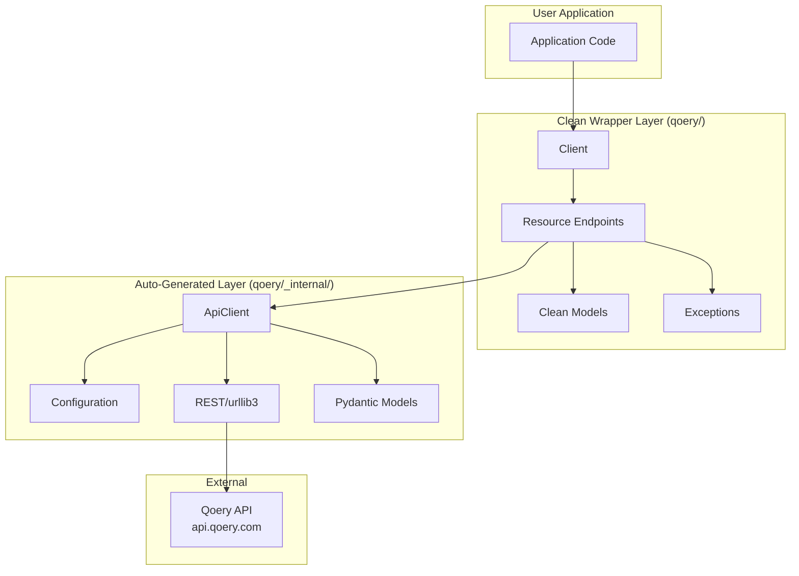
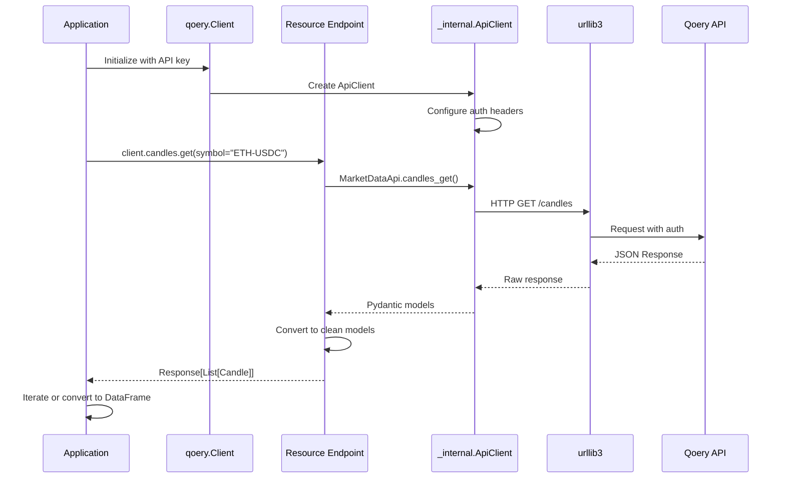
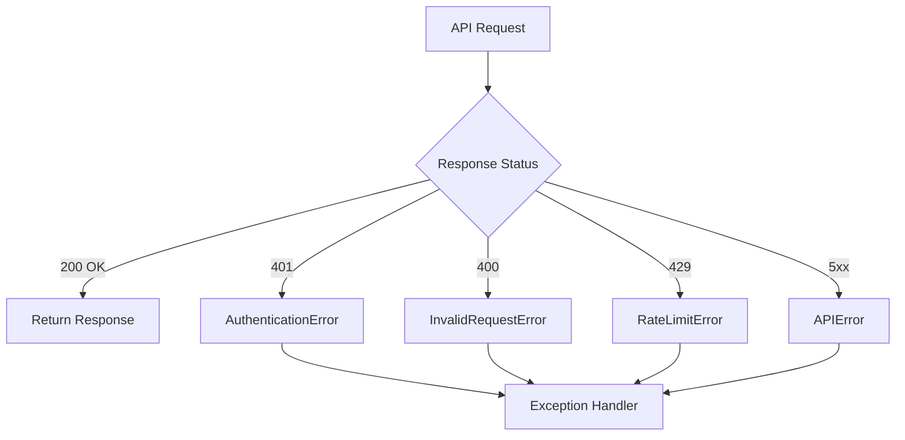
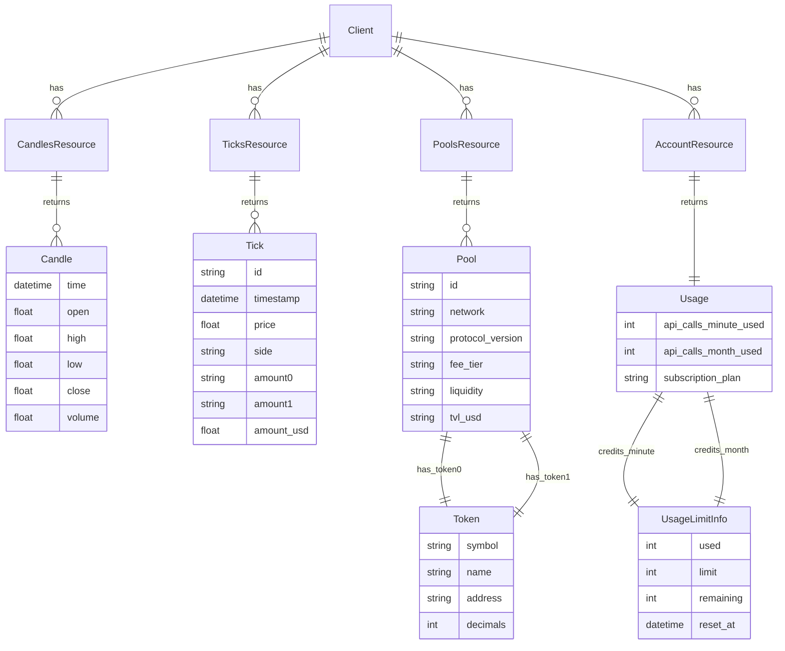
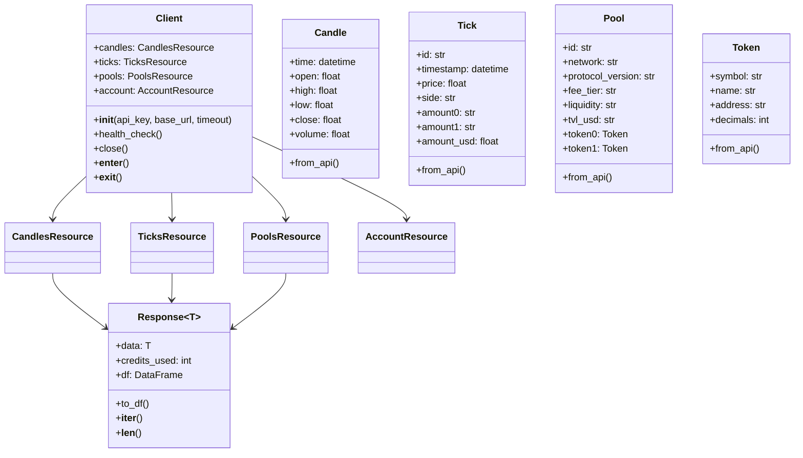
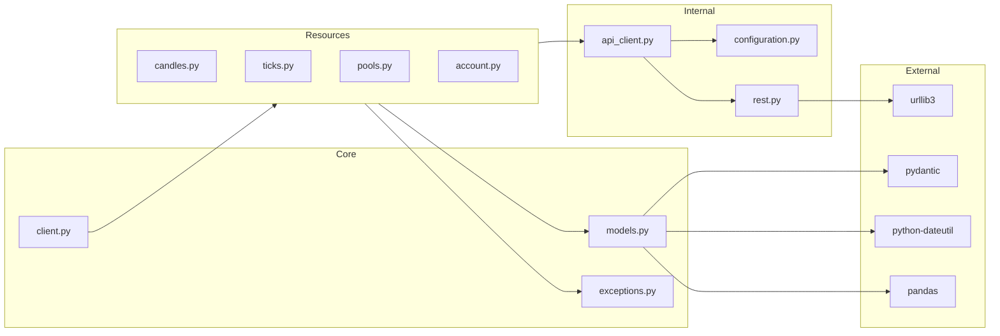

# Qoery Python SDK - Documentation

## Table of Contents
- [Project Overview](#project-overview)
- [Architecture Overview](#architecture-overview)
- [Project Structure](#project-structure)
- [Core Components](#core-components)
- [Data Flow](#data-flow)
- [Data Model](#data-model)
- [API Reference](#api-reference)
- [Configuration](#configuration)
- [Getting Started](#getting-started)
- [Development Guide](#development-guide)

---

## Project Overview

### Purpose

**Qoery Python SDK** (v0.6.0) is the official, developer-friendly Python wrapper for the Qoery DeFi Data API - the cheapest cryptocurrency data API on the market. It provides access to real-time and historical DeFi data from Uniswap and other Decentralized Exchanges (DEXs).

### Tech Stack

| Category | Technology |
|----------|------------|
| Language | Python 3.9+ |
| HTTP Client | urllib3 >= 2.1.0 |
| Validation | Pydantic >= 2.4 |
| Data Export | Pandas >= 1.3.0 |
| Date Handling | python-dateutil >= 2.8.2 |
| Build System | setuptools |
| Testing | pytest, tox |
| Type Checking | mypy |

### Key Features

- Simple, intuitive Python API
- OHLCV candle data with flexible intervals
- Raw tick-level swap transaction data
- Liquidity pool discovery
- Multi-network support (Ethereum, Arbitrum, Polygon, Base, Optimism)
- API usage tracking and rate limit monitoring
- Full type hints and dataclass support
- Pandas DataFrame integration
- Context manager support

### Supported Networks

| Network | Status |
|---------|--------|
| Ethereum | Supported |
| Arbitrum | Supported |
| Polygon | Supported |
| Base | Supported |
| Optimism | Supported |

---

## Architecture Overview

### High-Level Architecture



### Two-Layer Architecture

The SDK follows a **two-layer architecture** for clean separation of concerns:

| Layer | Location | Purpose |
|-------|----------|---------|
| Clean Wrapper | `qoery/` | User-friendly, Pythonic API designed for developers |
| Auto-Generated | `qoery/_internal/` | Generated from OpenAPI spec, handles low-level HTTP |

### Design Patterns

| Pattern | Usage |
|---------|-------|
| Factory | Client creates resource instances on initialization |
| Adapter | Wrapper adapts raw API models to clean dataclasses |
| Response Wrapper | Response class wraps data + metadata (credits_used) |
| Resource-Based | Endpoints grouped by resource type |

---

## Project Structure

```
qoery-py/
├── qoery/                          # Main package (clean wrapper - recommended)
│   ├── __init__.py                 # Package exports and public API
│   ├── client.py                   # Main Client class - entry point
│   ├── models.py                   # Clean dataclass models
│   ├── exceptions.py               # Custom exceptions
│   └── resources/                  # Resource endpoints
│       ├── __init__.py
│       ├── candles.py              # OHLCV candles endpoint
│       ├── ticks.py                # Raw tick data endpoint
│       ├── pools.py                # Pool discovery endpoint
│       └── account.py              # Account/usage statistics endpoint
│
├── qoery/_internal/                # Auto-generated OpenAPI client (private)
│   ├── __init__.py
│   ├── api_client.py               # Low-level HTTP client
│   ├── api_response.py             # Response wrapper
│   ├── configuration.py            # API configuration
│   ├── exceptions.py               # OpenAPI exceptions
│   ├── rest.py                     # REST utilities and urllib3 wrapper
│   ├── api/                        # Generated API endpoints
│   │   ├── account_api.py
│   │   ├── discovery_api.py
│   │   ├── market_data_api.py
│   │   └── system_api.py
│   └── models/                     # Generated Pydantic models
│       ├── candle.py
│       ├── pool.py
│       ├── tick.py
│       ├── token.py
│       └── usage_response.py
│
├── examples/                       # Usage examples
│   ├── simple_usage.py             # Modern clean examples
│   └── basic_usage.py              # Direct API examples
│
├── test/                           # Unit tests
├── docs/                           # API documentation
├── pyproject.toml                  # Project metadata
├── requirements.txt                # Dependencies
└── README.md                       # User documentation
```

---

## Core Components

### Client (`qoery/client.py`)

**Purpose:** Main entry point for all SDK operations. Manages configuration, authentication, and provides access to resource endpoints.

**Public API:**

| Method/Attribute | Type | Description |
|------------------|------|-------------|
| `__init__(api_key, base_url, timeout)` | Constructor | Initialize client |
| `candles` | CandlesResource | Access OHLCV candle data |
| `ticks` | TicksResource | Access raw tick/swap data |
| `pools` | PoolsResource | Access pool discovery |
| `account` | AccountResource | Access usage statistics |
| `health_check()` | Method | Check API health status |
| `close()` | Method | Close client and cleanup |

**Constructor Parameters:**

| Parameter | Type | Default | Description |
|-----------|------|---------|-------------|
| `api_key` | `str` | `QOERY_API_KEY` env | API authentication key |
| `base_url` | `str` | `https://api.qoery.com/v0` | API endpoint |
| `timeout` | `int` | `30` | Request timeout in seconds |

**Example:**

```python
import qoery

# Using environment variable
client = qoery.Client()

# Explicit configuration
client = qoery.Client(
    api_key="your-key",
    base_url="https://api.qoery.com/v0",
    timeout=30
)

# Context manager (recommended)
with qoery.Client() as client:
    candles = client.candles.get(symbol="ETH-USDC")
```

---

### CandlesResource (`qoery/resources/candles.py`)

**Purpose:** Retrieve OHLCV (Open, High, Low, Close, Volume) candlestick data.

**Public API:**

| Method | Parameters | Returns |
|--------|------------|---------|
| `get(**kwargs)` | See below | `Response[List[Candle]]` |
| `list(**kwargs)` | Alias for `get` | `Response[List[Candle]]` |

**Parameters:**

| Parameter | Type | Default | Description |
|-----------|------|---------|-------------|
| `symbol` | `str` | - | Trading pair (e.g., "ETH-USDC") |
| `pool` | `str` | - | Pool address (faster than symbol) |
| `interval` | `str` | `"15m"` | Candle size (1m, 5m, 15m, 1h, 4h, 1d) |
| `limit` | `int` | `10` | Number of candles (max 100) |
| `from_time` | `str` | - | Start time (ISO 8601) |
| `to_time` | `str` | - | End time (ISO 8601) |
| `networks` | `str` | - | Comma-separated networks |

**Example:**

```python
candles = client.candles.get(
    symbol="ETH-USDC",
    interval="15m",
    limit=10
)

for candle in candles:
    print(f"{candle.time}: ${candle.close}")

# Convert to DataFrame
df = candles.df
```

---

### TicksResource (`qoery/resources/ticks.py`)

**Purpose:** Retrieve raw tick-level swap transaction data.

**Public API:**

| Method | Parameters | Returns |
|--------|------------|---------|
| `get(**kwargs)` | See below | `Response[List[Tick]]` |
| `list(**kwargs)` | Alias for `get` | `Response[List[Tick]]` |

**Parameters:**

| Parameter | Type | Default | Description |
|-----------|------|---------|-------------|
| `symbol` | `str` | - | Trading pair |
| `pool` | `str` | - | Pool address |
| `limit` | `int` | `100` | Number of ticks (max 1000) |
| `from_time` | `str` | - | Start time |
| `to_time` | `str` | - | End time |
| `networks` | `str` | - | Comma-separated networks |

**Example:**

```python
ticks = client.ticks.get(symbol="WBTC-USDT", limit=20)

for tick in ticks:
    print(f"{tick.timestamp}: ${tick.price} ({tick.side})")
```

---

### PoolsResource (`qoery/resources/pools.py`)

**Purpose:** Discover liquidity pools for trading pairs.

**Public API:**

| Method | Parameters | Returns |
|--------|------------|---------|
| `find(symbol)` | `symbol: str` | `Response[List[Pool]]` |
| `search(**kwargs)` | Alias for `find` | `Response[List[Pool]]` |
| `list(**kwargs)` | Alias for `find` | `Response[List[Pool]]` |

**Example:**

```python
pools = client.pools.find(symbol="ETH-USDC")

for pool in pools:
    print(f"{pool.network}: TVL ${pool.tvl_usd}")
```

---

### AccountResource (`qoery/resources/account.py`)

**Purpose:** Retrieve account and API usage information.

**Public API:**

| Method | Parameters | Returns |
|--------|------------|---------|
| `usage()` | None | `Usage` |
| `get_usage()` | Alias for `usage` | `Usage` |

**Example:**

```python
usage = client.account.usage()

print(f"Plan: {usage.subscription_plan}")
print(f"Credits: {usage.credits_month.used}/{usage.credits_month.limit}")
print(f"Remaining: {usage.credits_month.remaining}")
```

---

## Data Flow

### Request Lifecycle



### Error Handling Flow



---

## Data Model

### Entity Relationships



### Class Diagram



---

## API Reference

### Authentication

All API requests require an API key passed via the `X-API-Key` header. The SDK handles this automatically.

### Endpoints Overview

| Resource | Method | Endpoint | Description |
|----------|--------|----------|-------------|
| Candles | GET | `/candles` | OHLCV candlestick data |
| Ticks | GET | `/ticks` | Raw swap transactions |
| Pools | GET | `/pools` | Pool discovery |
| Account | GET | `/usage` | Usage statistics |
| System | GET | `/health` | Health check |

### Response Format

All responses include:
- `data` - The requested data (list or single object)
- `credits_used` - API credits consumed by the request

### Exception Types

| Exception | HTTP Code | Description |
|-----------|-----------|-------------|
| `AuthenticationError` | 401 | Missing or invalid API key |
| `InvalidRequestError` | 400 | Invalid request parameters |
| `RateLimitError` | 429 | Rate limit exceeded |
| `APIError` | 5xx | Unexpected server error |

**Example Error Handling:**

```python
import qoery

try:
    candles = client.candles.get(symbol="ETH-USDC")
except qoery.AuthenticationError:
    print("Invalid API key")
except qoery.InvalidRequestError as e:
    print(f"Bad request: {e}")
except qoery.RateLimitError:
    print("Rate limit exceeded, try again later")
except qoery.APIError as e:
    print(f"Server error: {e.status_code}")
```

---

## Configuration

### Environment Variables

| Variable | Required | Default | Description |
|----------|----------|---------|-------------|
| `QOERY_API_KEY` | Yes | - | API authentication key |

### Client Options

| Option | Type | Default | Description |
|--------|------|---------|-------------|
| `api_key` | `str` | env var | Override API key |
| `base_url` | `str` | `https://api.qoery.com/v0` | API endpoint |
| `timeout` | `int` | `30` | Request timeout (seconds) |

### .env File Support

The SDK automatically loads environment variables from a `.env` file:

```env
QOERY_API_KEY=your-api-key-here
```

---

## Getting Started

### Prerequisites

- Python 3.9+
- pip or poetry

### Installation

```bash
# Using pip
pip install qoery

# Using poetry
poetry add qoery
```

### Quick Start

```python
import qoery

# Initialize client (uses QOERY_API_KEY env var)
client = qoery.Client()

# Get OHLCV candles
candles = client.candles.get(
    symbol="ETH-USDC",
    interval="15m",
    limit=10
)

# Print candle data
for candle in candles:
    print(f"{candle.time}: Open ${candle.open:.2f}, Close ${candle.close:.2f}")

# Convert to Pandas DataFrame
df = candles.df
print(df.head())

# Check API usage
usage = client.account.usage()
print(f"Credits used this month: {usage.credits_month.used}")

# Clean up
client.close()
```

### Using Context Manager

```python
import qoery

with qoery.Client() as client:
    # Get raw tick data
    ticks = client.ticks.get(symbol="WBTC-USDT", limit=20)

    for tick in ticks:
        print(f"{tick.timestamp}: ${tick.price} ({tick.side})")

    # Find available pools
    pools = client.pools.find(symbol="ETH-USDC")

    for pool in pools:
        print(f"{pool.network} - TVL: ${pool.tvl_usd}")
```

---

## Development Guide

### Setting Up Development Environment

```bash
# Clone repository
git clone https://github.com/qoery/qoery-py
cd qoery-py

# Create virtual environment
python -m venv venv
source venv/bin/activate  # or `venv\Scripts\activate` on Windows

# Install dependencies
pip install -r requirements.txt
pip install -r test-requirements.txt
```

### Running Tests

```bash
# Run all tests
pytest

# Run with coverage
pytest --cov=qoery

# Run with tox (multiple Python versions)
tox
```

### Code Style

```bash
# Linting
flake8 qoery/

# Type checking
mypy qoery/
```

### Regenerating Auto-Generated Code

The `qoery/_internal/` directory is auto-generated from the OpenAPI spec:

```bash
openapi-generator-cli generate \
  -i docs/openapi.yaml \
  -g python \
  -o . \
  --package-name qoery
```

**Protected Files** (not overwritten):
- `qoery/` (clean wrapper)
- `examples/`
- `README.md`
- `COMPARISON.md`

### Adding New Features

1. Update OpenAPI spec (if API changes)
2. Regenerate internal client
3. Add/update wrapper in `qoery/resources/`
4. Add/update models in `qoery/models.py`
5. Export in `qoery/__init__.py`
6. Add tests in `test/`
7. Update documentation

### Project Dependencies



---

## Summary

| Aspect | Details |
|--------|---------|
| **Project Type** | Python SDK / Library |
| **Version** | 0.6.0 |
| **Python Support** | 3.9+ |
| **License** | MIT |
| **Entry Point** | `qoery.Client` |
| **Architecture** | Two-layer (wrapper + auto-generated) |
| **Resources** | 4 (candles, ticks, pools, account) |
| **Models** | 10+ dataclasses |
| **Auth Method** | API Key header |
| **Rate Limiting** | Credits-based system |
| **Data Export** | Pandas DataFrame |
| **Networks** | 5 blockchains |

---

*Generated for Qoery Python SDK v0.6.0*
